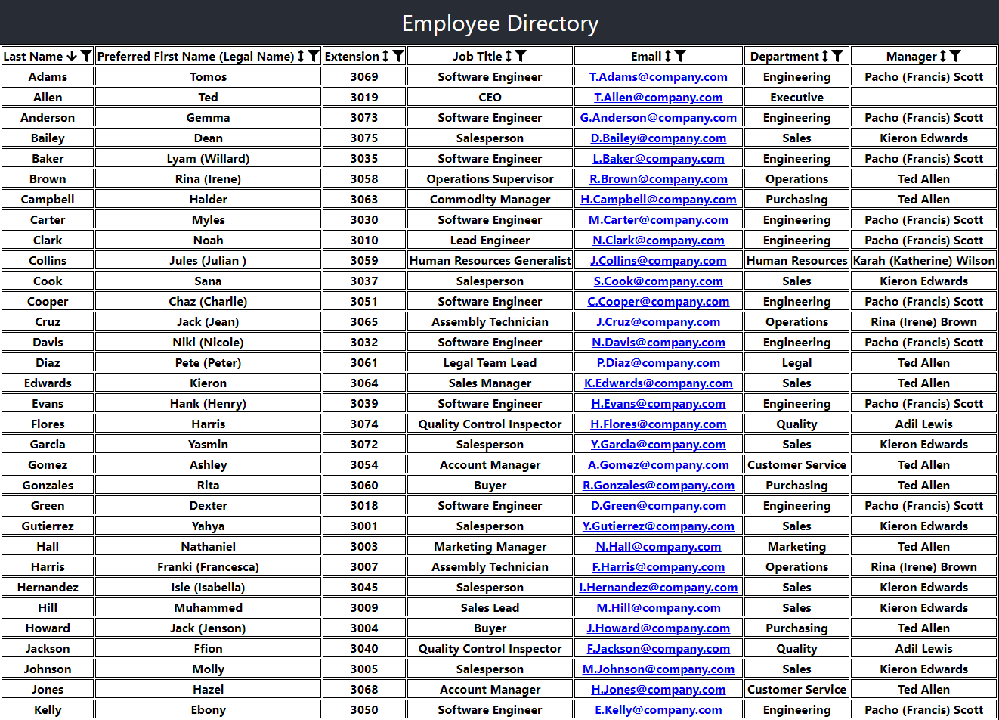
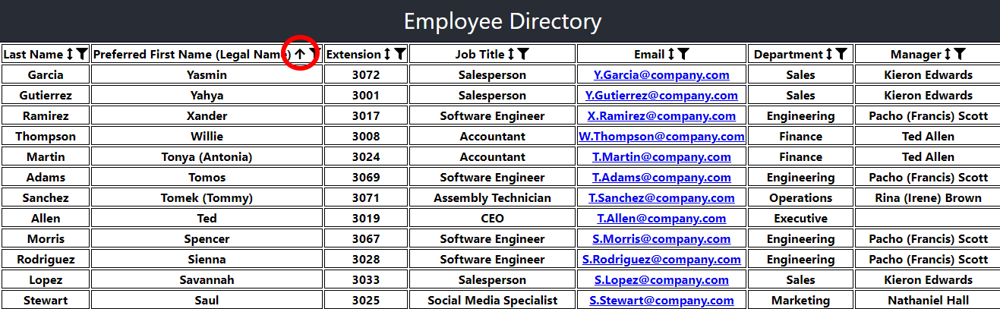
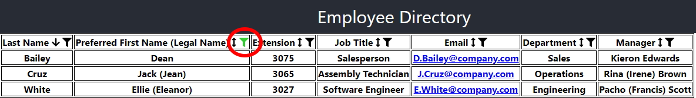
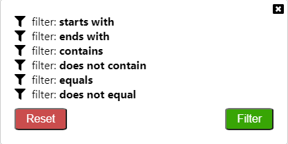
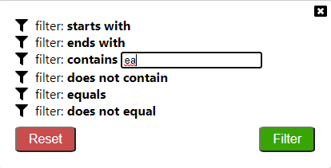

# Employee Directory
[](https://opensource.org/licenses/ISC)

[Live Site - https://zarlengo.github.io/Employee-Directory/index.html](https://zarlengo.github.io/Employee-Directory/index.html)

## Description
A React app to display non-sensitive employee information to an organization.



## Table of Contents

1. [Installation](#1-installation)
2. [Usage](#2-usage)
3. [License](#3-license)
4. [Contributing](#4-contributing)
6. [Questions](#5-questions)

## 1 Installation
1. Download repository
	```
	HTTPS: Git clone https://github.com/Zarlengo/Employee-Directory.git
    SSH: Git clone git@github.com:Zarlengo/Employee-Directory.git
	```

2. Install dependencies
	```
	npm install
	```

3. Start the server
    ```
    npm run start
    ```

4. Navigate to localhost:3000
    You can now view employee_directory in the browser.

    [Local:            http://localhost:3000/Employee-Directory](http://localhost:3000)

5. To use the site without a node server. Creates a build folder with html/css/js files
    ```
    npm run build
    ```

## 2 Usage


#### Sorting



Each column can be sorted in ascending or in descending order by clicking the arrow in the column header. The arrow indicates the current column being sorted and the direction of the arrow shows which direction the column is sorted (Down - Ascending, Up - Descending, Up & Down - Not Sorted).


#### Filtering


Each column can be filtered by clicking on the filter icon in the column header. A green colored filter icon indicates that the column currently has a filter applied to it. Clicking on the filter icon will bring up the filter menu.



* Starts with
* Ends with
* Contains
* Does not contain
* Equals
* Does not equal



Clicking a desired filter mode will show an input field to allow the user to enter the filtering condition.



* Reset - removes any filters from the directory
* Filter - applies current filter criteria to the directory
* X - closes the filter windows (maintains current filter)
* Clicking outside of the modal will close the filter window (maintains the current filter)


## 3 License
    Copyright © 2020 Chris Zarlengo
    Permission to use, copy, modify, and/or distribute this software for any
    purpose with or without fee is hereby granted, provided that the above
    copyright notice and this permission notice appear in all copies.

    THE SOFTWARE IS PROVIDED "AS IS" AND THE AUTHOR DISCLAIMS ALL WARRANTIES
    WITH REGARD TO THIS SOFTWARE INCLUDING ALL IMPLIED WARRANTIES OF
    MERCHANTABILITY AND FITNESS. IN NO EVENT SHALL THE AUTHOR BE LIABLE FOR ANY
    SPECIAL, DIRECT, INDIRECT, OR CONSEQUENTIAL DAMAGES OR ANY DAMAGES
    WHATSOEVER RESULTING FROM LOSS OF USE, DATA OR PROFITS, WHETHER IN AN ACTION
    OF CONTRACT, NEGLIGENCE OR OTHER TORTIOUS ACTION, ARISING OUT OF OR IN
    CONNECTION WITH THE USE OR PERFORMANCE OF THIS SOFTWARE.

## 4 Contributing
* [Zarlengo](https://github.com/Zarlengo)

## 5 Questions
* [Github Profile for Zarlengo](https://github.com/Zarlengo)
* [Send email to christopher@zarlengo.net](mailto:christopher@zarlengo.net)
* [File an issue](https://github.com/Zarlengo/Employee-Directory/issues)
